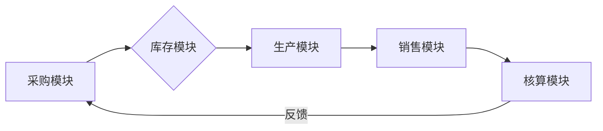

### **一、业务流程总览**

系统采用采购-库存-生产-销售-核算五阶段闭环设计，关键数据流如下：



### **二、核心业务流程详解**

#### 1. 采购管理流程（含财务控制）

1. **需求处理**

   - 自动触发条件：库存量＜安全库存+在途量
   - 人工干预：紧急采购需财务总监电子审批
2. **三单匹配机制**


   | 单据类型 | 校验规则           | 财务影响       |
   | -------- | ------------------ | -------------- |
   | 采购订单 | 供应商信用额度校验 | 预付款比例控制 |
   | 入库单   | 数量公差±5%       | 暂估入账触发   |
   | 发票     | 税率与合同一致性   | 进项税自动认证 |
3. **异常处理流程**

   ```mermaid
   sequenceDiagram
     质检不合格->>供应商: 扣款通知单
     供应商->>财务: 争议处理
     财务->>系统: 应付账款锁定
   ```

#### 2. 库存管理流程（业财联动）

1. **日常操作规范**

   - 入库：必须关联采购订单号，系统自动计算：
     ```
     新成本 = (原库存金额 + 本次入库金额) / (原数量 + 本次入库数量)
     ```
   - 出库：强制选择成本核算方法（移动加权/先进先出）
2. **特殊业务处理**

   - 调拨业务：生成《内部交易单》并触发：
     - 借：库存商品（调出方）
     - 贷：库存商品（调入方）
   - 报损处理：需上传《资产损失申报表》电子附件

#### 3. 财务核算流程

1. **成本核算规则**


   | 业务场景 | 核算方法            | 凭证模板                          |
   | -------- | ------------------- | --------------------------------- |
   | 生产领料 | 标准成本法+差异分摊 | 借：生产成本 贷：原材料           |
   | 销售出库 | 移动加权平均        | 借：主营业务成本 贷：库存商品     |
   | 月末结账 | 存货跌价准备计提    | 借：资产减值损失 贷：存货跌价准备 |
2. **对账机制**

   - 每日自动生成《库存余额调节表》
   - 差异处理流程：
     ```mermaid
     graph TB
     系统对账-->|差异＞0.5%| 财务复核
     财务复核-->|确认差异| 生成调整凭证
     ```

### **三、系统控制要点**

1. **权限矩阵**


   | 功能模块   | 操作员权限        | 审批层级      |
   | ---------- | ----------------- | ------------- |
   | 成本价修改 | 仅财务主管        | 需CFO电子签名 |
   | 库存报废   | 仓库主管+财务专员 | 双人复核机制  |
2. **审计追踪**

   - 所有操作记录包含：
     - 操作人ID
     - 时间戳（精确到毫秒）
     - 原始单据哈希值
     - 变更前后数据快照
3. **接口规范**

   - 与税务系统对接：进项发票自动验真
   - 与生产系统对接：实时同步在制品状态
